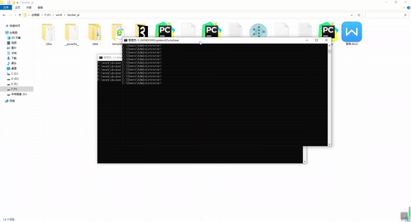

# Remote_Course

##1.本工程的目标
手写数字识别是深度学习的经典应用之一，特别是对Mnist数据集的训练识别，是深度学习训练常选的基础数据集。为此，我们基于经典的AlexNet编写卷积神经网络，对Mnist数据集进行训练，生成手写数字识别模型，并基于Flask框架提供识别服务。通过设计简单的网页端界面，允许用户选择图片并上传到此识别服务，然后识别并返回给前端用户。此外，本工程还基于Cassandra提供上传记录的保存功能，记录上传时间、文件名和预测结果等信息，有助于进一步的模型检查和数据分析。
为此，我们基于Docker容器进行封装，可方便的进行编译打包，实现识别服务的快速部署和启动。

##2.操作过程

##3.安装要求
flask
torch
torchvision
numpy
pillow
werkzeug
cassandra-driver

##4.运行方法 
（1）cassandra
下载
docker pull cassandra
启动
docker run -d -p 9042:9042 cassandra
命令
docker container ls
查找cassandra的运行ID，例如cf788e3b9040
docker exec -it cf788e3b9040 cqlsh
（2）docker
封装
docker build -t simple_app .
启动
docker run -p 5000:4000 simple_app
（3）浏览器访问
访问http://127.0.0.1:5000/，上传图片执行识别。

##5. 其他
请参照报告文档。
